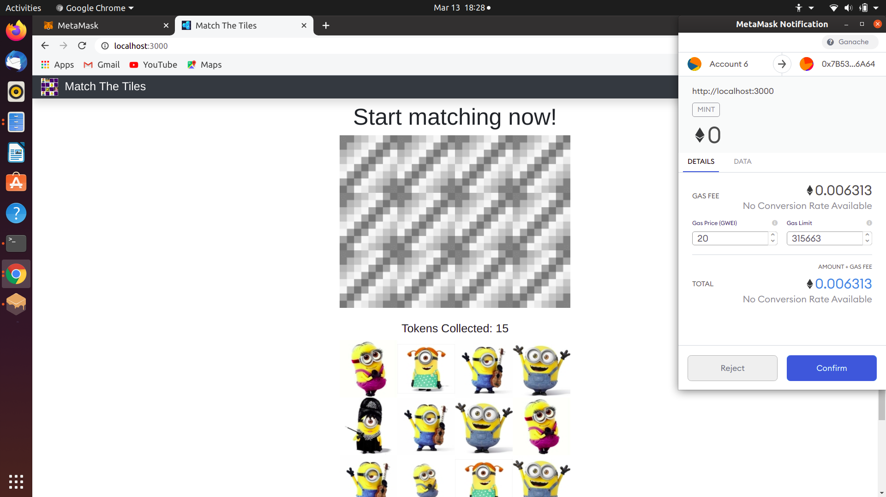
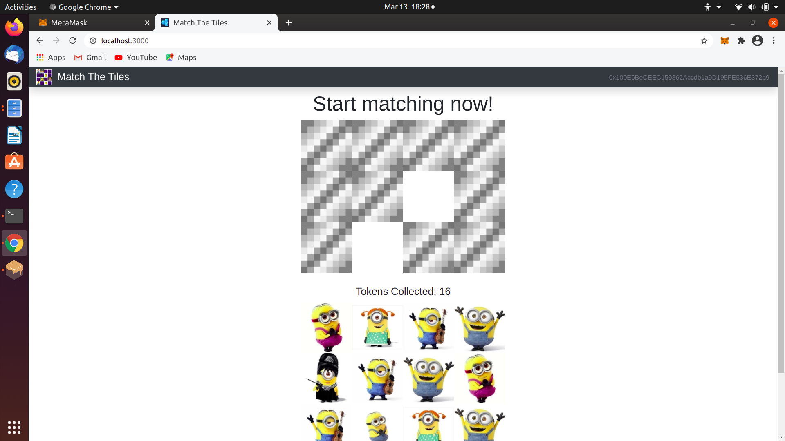
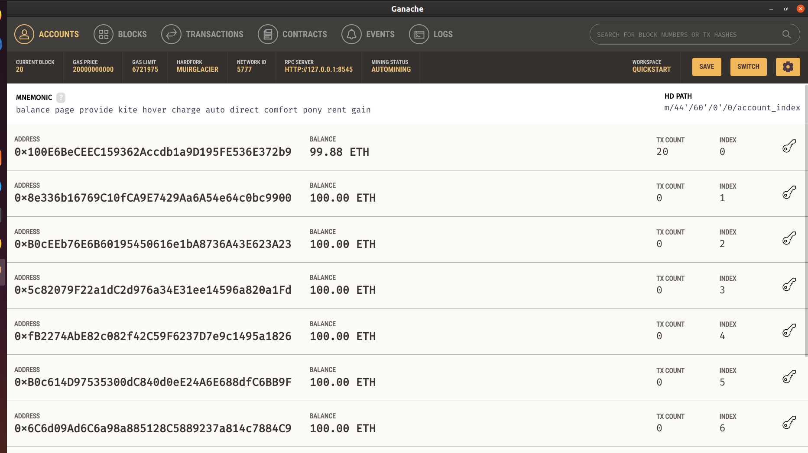
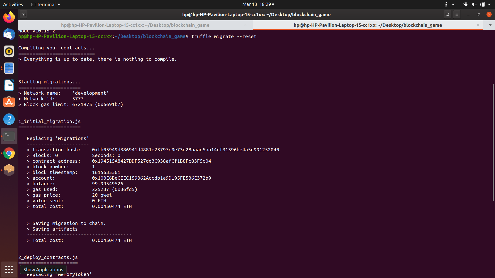
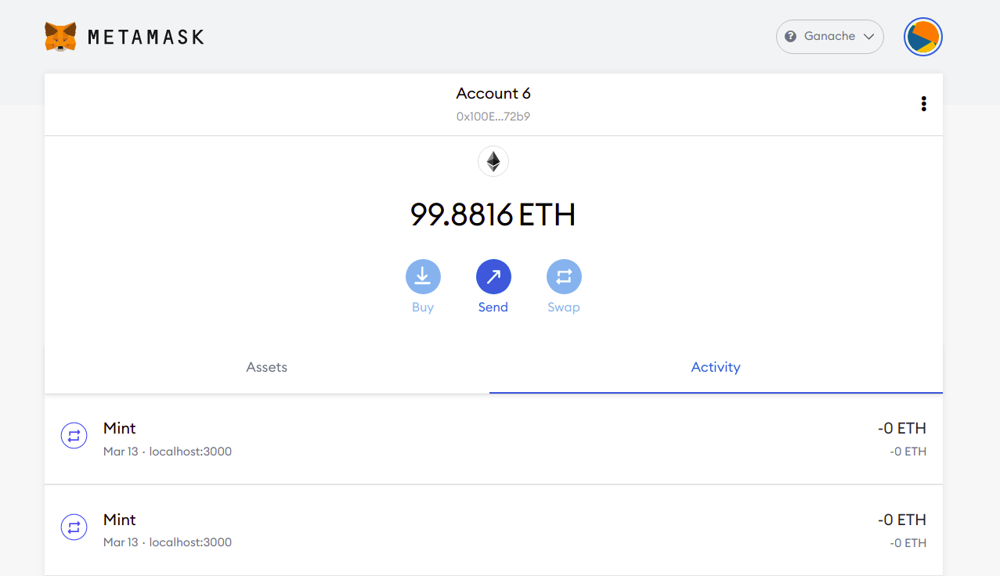

# Shehacks_Team-003

This is our submission for SheHack 2021 hackathon

## Team Members
Keerti Chaudhary ([@keerti2001](https://github.com/keerti2001))  
Shumbul Arifa ([@shumbul](https://github.com/shumbul))

## Match The Tiles Demo Video
 Video link [here](https://youtu.be/ydGQe8OKvU0).
  
## Match The Tiles
This is a Blockchain based memory game, where the user is supposed to find matching tiles. As soon as the user finds a match, the user gets to keep it forever of the Blockchain.
Each tiles is represented by a blockchain token, which can be kept in wallet after getting matched. These tokens can be transfered outside of the game or keep them as collectables.  

## Working
We have client side website, where the tokens are matched. After which the tiles associated with tokens. These tokens are powered by Ethereum Smart Cotracts, which act as business logic for these tokens. 
These Ethereum Smart Contracts govern the ownership of these tokens. They act as our backend database in our case. 
Once these tokens are in public, they can be transferred to any other Blockchain wallet or sold. 
The kind of token we have used is Non-Fungible tokens (Like Cryptokitties), memory tokens that are collectables that we win by playing this game. 
Non-fungible tokens (NFTs) are used to create verifiable digital scarcity, as well as representing asset ownership of things like real estate, luxury goods, works of art, or collectible objects in video games (CryptoKitties is an early example). Essentially, NFTs are used for items that require a unique digital fingerprint. 

  
   
  

 
## Game Rules
1. In this game the user has to select two cards at a time.  
2. If the next card you flip matches, a pop-up alert notifies you and you get +1 to your Tokens Collected. 
3. Also Metamask pop-up shows up and the non fungible coins are transferred to the Ethereum network. 
4. All the coins are collected and stored. 
5. These cards then disappear. 
6. If the token pairs do not match, a pop-up alert notifies you of this and the cards flip back. 
7. The game continues until you have all the matching pairs of tiles. 

## Technologies used

**Ethereum / Solidity**  
Ethereum is open access to digital money and data-friendly services for everyone – no matter your background or location.   
Solidity is an object-oriented, high-level language for implementing smart contracts. Smart contracts are programs that govern the behavior of accounts within the Ethereum state.  

**Ganache** 
Ganache is a virtual blockchain that sets up 10 default Ethereum addresses, complete with private keys and all, and pre-loads them with 100 simulated Ether each.  

  

**Truffle** 
A world-class development environment, testing framework, and asset pipeline for blockchains using the Ethereum Virtual Machine (EVM), aiming to make life as a developer easier.  

  

**Metamask** 
MetaMask is a software cryptocurrency wallet used to interact with the Ethereum blockchain. MetaMask allows users to store and manage account keys, broadcast transactions, send and receive Ethereum-based cryptocurrencies. 

  

**ReactJs** 
React (also known as React.js or ReactJS) is an open-source, front-end, JavaScript library for building user interfaces or UI components. It is maintained by Facebook and a community of individual developers and companies. 

